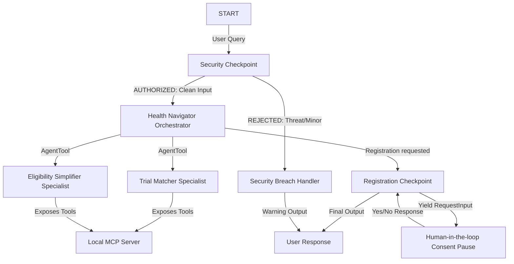
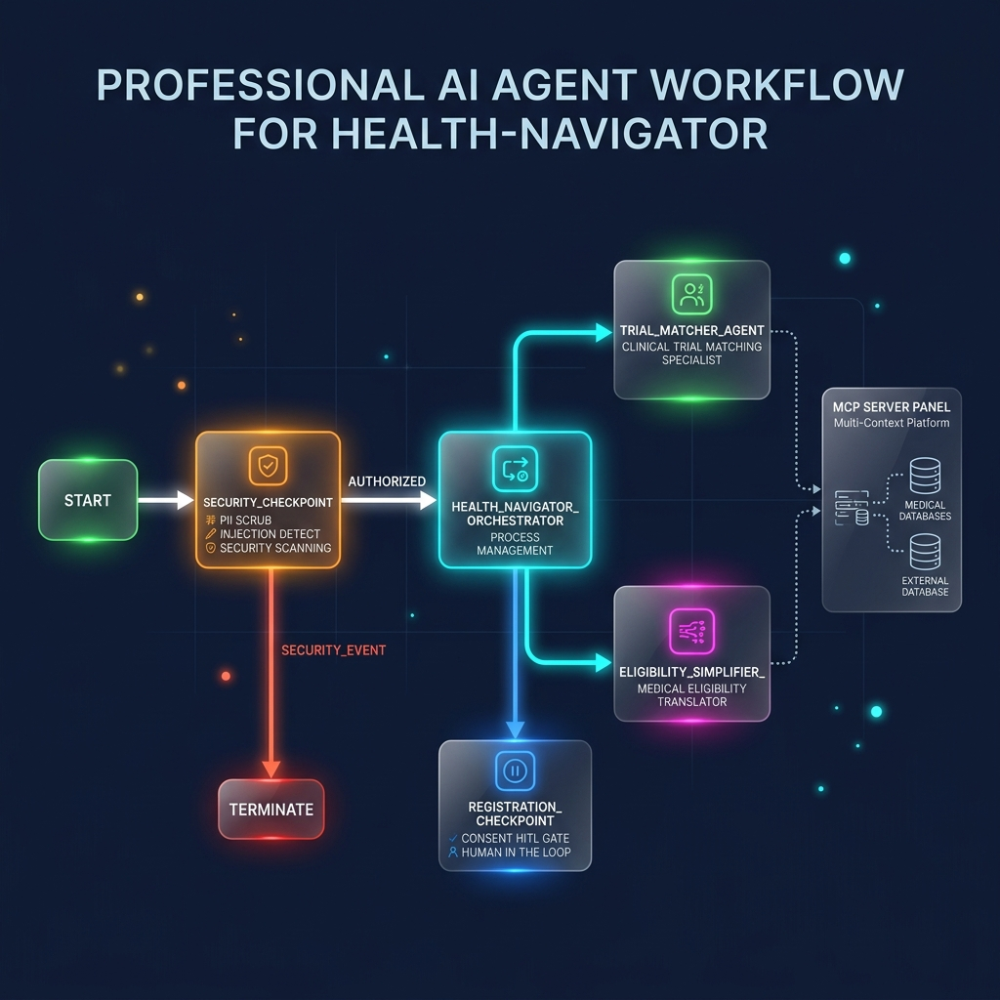
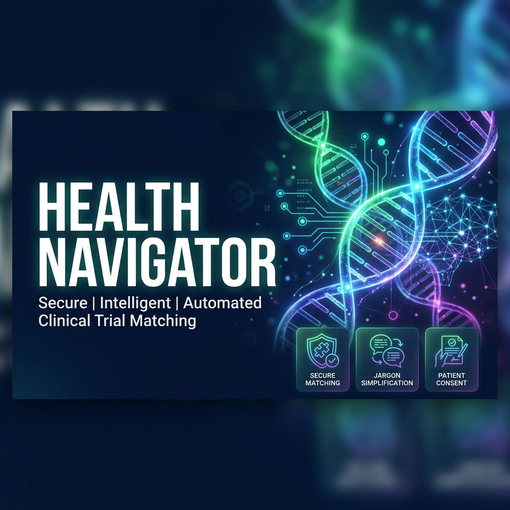

# Health Navigator

An intelligent, secure multi-agent clinical trial matching assistant and jargon simplifier built with the Google Agent Development Kit (ADK) 2.0.

## Prerequisites

- Python 3.11 - 3.13
- [uv](https://docs.astral.sh/uv/) (Python package manager)
- Google Gemini API Key from [Google AI Studio](https://aistudio.google.com/apikey)

## Quick Start

1. **Clone the repository:**
   ```bash
   git clone <repo-url>
   cd health-navigator
   ```

2. **Configure environment:**
   ```bash
   cp .env.example .env   # Add your GOOGLE_API_KEY
   ```

3. **Install dependencies:**
   ```bash
   make install
   ```

4. **Launch the interactive playground:**
   ```bash
   make playground        # Opens UI at http://localhost:18081
   ```

## Architecture

This project uses the ADK 2.0 graph-based Workflow API. Below is the system flow:



## How to Run

- **Interactive UI (Playground):** `make playground` (runs on http://localhost:18081)
- **Local API Web Server:** `make run` (runs the FastAPI server)
- **Run Tests:** `make test`

## Sample Test Cases

### Test Case 1: Search and Match
- **Input:** `"Show me clinical trials recruiting for lung cancer."`
- **Expected:** The Orchestrator routes the request to the `trial_matcher_agent` which queries the local MCP server and returns the matching trial (`NCT01123456`).
- **Check:** Look for the local MCP tool logs showing execution of `search_clinical_trials`.

### Test Case 2: Medical Jargon translation & Eligibility Check
- **Input:** `"What are the eligibility criteria for NCT01123456? Can you explain what NSCLC and ECOG mean?"`
- **Expected:** The Orchestrator calls the `eligibility_simplifier_agent`, which retrieves details for `NCT01123456` and translates NSCLC and ECOG into layman's terms.
- **Check:** The response should display patient-friendly definitions of NSCLC and ECOG performance status alongside the trial eligibility list.

### Test Case 3: Registration Consent Gate (Human-in-the-Loop)
- **Input:** `"I want to apply for NCT01123456. My name is John Doe, email is john.doe@example.com, and SSN is 123-45-6789."`
- **Expected:**
  1. The Security Checkpoint scrubs the SSN to `[REDACTED SSN]`.
  2. The Orchestrator initiates registration.
  3. The workflow pauses and prompts for consent: `✋ [HITL Consent Required] Do you consent to share...`
  4. Replying `"Yes"` completes the registration and displays coordinator contact information.
- **Check:** Review the terminal logs for the JSON audit logs showing `pii_scrubbed: true` and the consent transition.

## Assets

### Workflow Architecture


### Cover Banner


## Demo Script

For the spoken presentation script, see [DEMO_SCRIPT.txt](DEMO_SCRIPT.txt).

## Troubleshooting

1. **Error: `ModuleNotFoundError: No module named 'mcp'`**
   - *Fix:* Run `make install` or `uv sync` to ensure dependencies from `pyproject.toml` are correctly installed.
2. **Error: `no agents found` or `extra arguments` when starting the playground**
   - *Fix:* Verify you are running `make playground` from the project root directory. Ensure the target directory name in the Makefile is correct (it should be `app`).
3. **Error: `API_KEY` issues or 404 models**
   - *Fix:* Ensure `.env` is populated with a valid key and `GEMINI_MODEL=gemini-2.5-flash` is set. Note that gemini-1.5 models are retired.

## Push to GitHub

1. Create a new repo at https://github.com/new
   - Name: `health-navigator`
   - Visibility: Public or Private
   - Do NOT initialize with README (you already have one)

2. In your terminal, navigate into your project folder:
   ```bash
   cd health-navigator
   git init
   git add .
   git commit -m "Initial commit: health-navigator ADK agent"
   git branch -M main
   git remote add origin https://github.com/<your-username>/health-navigator.git
   git push -u origin main
   ```

3. Verify `.gitignore` includes:
   - `.env` (your API key — must NEVER be pushed)
   - `.venv/`
   - `__pycache__/`
   - `*.pyc`
   - `.adk/`

⚠️ NEVER push `.env` to GitHub. Your API key will be exposed publicly.
