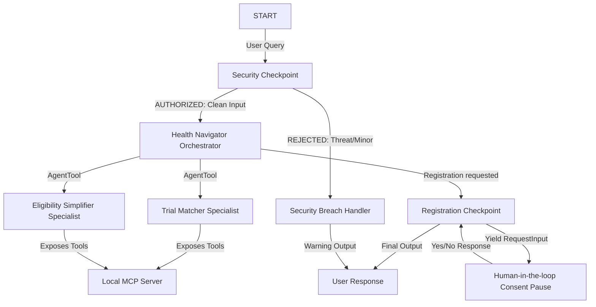

# Submission Write-Up: Health Navigator

## Problem Statement

Navigating the landscape of clinical trials is extremely difficult for patients. Key challenges include:
- **Complex Medical Jargon:** Eligibility criteria use abbreviations and terminology (e.g., ECOG, metastatic, NSCLC) that patients cannot easily interpret.
- **Trial Discovery:** Finding relevant clinical trials requires parsing through thousands of entries.
- **Privacy and Consent:** Sharing personal medical profiles and contact details with clinical trial staff must be strictly consented to and protected against accidental disclosure.

`Health Navigator` solves these challenges by providing an empathetic, conversational, and highly secure AI matching and translation pipeline.

## Solution Architecture

The agent uses a graph-based workflow (ADK 2.0) that guarantees safety validation and consent checks are executed prior to processing and completing user registrations.

## Concepts Used

- **ADK Workflow:** Graph topology representing nodes and conditional routing defined in [app/agent.py](file:///Users/manju/Desktop/adk%20workspace/health-navigator/app/agent.py#L198-L208).
- **LlmAgent:** Specialized conversational models with dedicated instructions defined in [app/agent.py](file:///Users/manju/Desktop/adk%20workspace/health-navigator/app/agent.py#L31-L86).
- **AgentTool:** Used by the orchestrator to delegate subtasks to the specialized agents in [app/agent.py](file:///Users/manju/Desktop/adk%20workspace/health-navigator/app/agent.py#L98-L99).
- **MCP Server:** Local stdio MCP server exposing medical search and translation tools in [app/mcp_server.py](file:///Users/manju/Desktop/adk%20workspace/health-navigator/app/mcp_server.py).
- **Security Checkpoint:** A dedicated `security_checkpoint` workflow node that intercepts input before LLM invocation, scrubs PII, detects injections, and logs details in [app/agent.py](file:///Users/manju/Desktop/adk%20workspace/health-navigator/app/agent.py#L107-L157).
- **Agents CLI:** Scaffolding, local playground testing, and package dependency management configured via [pyproject.toml](file:///Users/manju/Desktop/adk%20workspace/health-navigator/pyproject.toml) and [Makefile](file:///Users/manju/Desktop/adk%20workspace/health-navigator/Makefile).

## Security Design

Medical applications require strict security and privacy controls:
1. **PII Redaction (SSN):** Prevents Social Security Numbers or similar identifiers from being passed to the downstream LLM.
2. **Prompt Injection Mitigation:** Blocks user input containing instructions designed to override system prompt parameters.
3. **Structured Audit Logging:** Every security decision is logged in JSON format with severity levels (`INFO`, `WARNING`, `CRITICAL`) for audit and monitoring.
4. **Minor Age Protection Rule:** A domain policy that restricts matching or registration for users under 18 without parental presence.

## MCP Server Design

The MCP server exposes three main tools:
- `search_clinical_trials`: Searches clinical trials based on condition keywords.
- `get_trial_details`: Retrieves the eligibility criteria and coordinator details.
- `translate_jargon`: Simplifies complex medical terms like "NSCLC", "ECOG", and "eGFR".

## HITL (Human-in-the-Loop) Flow

When the orchestrator triggers the `request_trial_registration` tool, the workflow session state is updated with a `pending_registration` dict. The `registration_checkpoint` node intercepts the output, yields a `RequestInput` event, and pauses execution. The user must provide clear consent (`Yes` / `No`) to share their contact email and name before registration is completed.

## Demo Walkthrough

1. **Step 1:** Search for "lung cancer" trials. The matching agent returns `NCT01123456`.
2. **Step 2:** Ask to explain the eligibility details of `NCT01123456`. The simplification agent defines NSCLC and ECOG in plain terms.
3. **Step 3:** Request to apply, providing personal details including an SSN. The security node redacts the SSN, the session pauses for consent, and the user approves the submission by replying "Yes".

## Impact & Value Statement

`Health Navigator` empowers patients by demystifying clinical trials, making life-saving research accessible and understandable, all while enforcing industry-standard security and human-in-the-loop patient consent controls.
